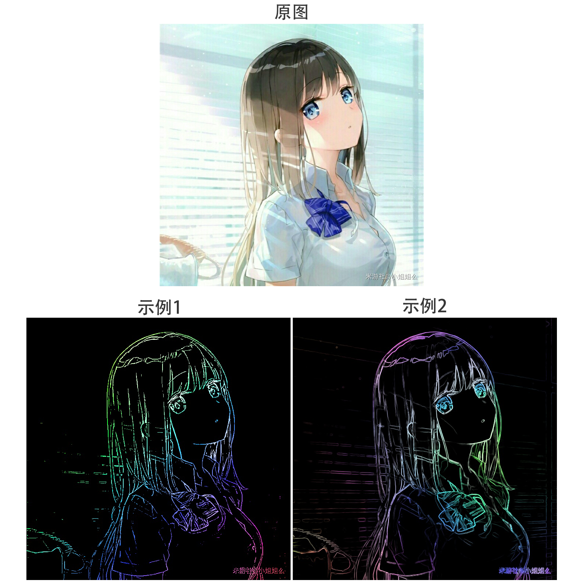



    

        
        <h1>ChromaLine 炫彩剪影</h1>
        <em>✨一个功能丰富的图片线稿提取器✨</em>
    

---

## 简介
这个主要使用 Python 编写的软件，源于我对 [OpenCV](https://github.com/opencv) 的兴趣和尝试。

借助 OpenCV 内置的函数，可以方便的对图像进行实时处理。后来我注意到，仅通过 `降噪` **⇨** `线化` **⇨** `渲染` 三个步骤，就能从任何插画得到让人眼前一亮的多彩线稿，多么有趣！因此我把这个逻辑提取出来，写了这样一个带有图形页面的小程序来提取线稿，还支持实时预览、批量导出等功能。

>OpenCV 是世界上最大的开源计算机视觉库，包含了一系列图像处理、分析、机器视觉方面的经典算法和 AI 算法。其中 Python 接口包含在第三方库 [cv2](https://docs.opencv.org/4.5.4/d2/d96/tutorial_py_table_of_contents_imgproc.html) 中。

## 文件说明
* 源代码 - [src目录](src)（其中程序入口为main.py）
* EXE程序 - [Release](https://github.com/clostou/ChromaLine/releases)

## 使用效果

    

        <em>开发完成于2023.3.21 Git上传于2024.2.27</em>
    

